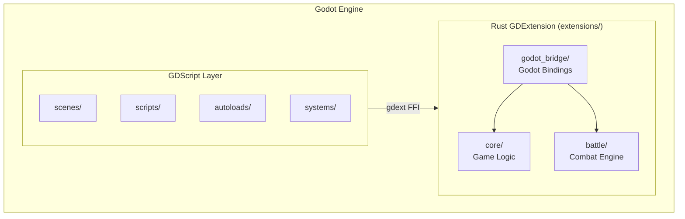

# ☯ Xiangke (相剋)

A Three Kingdoms turn-based command battle game built with **Godot Engine 4.7**
and **Rust GDExtension**.


> [!IMPORTANT]
> **This project is under active development.** APIs, game mechanics, and
> project structure may change without notice.

## 📖 Overview

Xiangke (相剋) is a turn-based command battle game set in the Three Kingdoms.
Players command legendary heros, each with abilities based on Yin-Yang and the
Five Elements (陰陽五行) principles.

The game logic core is implemented in **Rust** for performance and safety,
bridged to Godot via [gdext](https://github.com/godot-rust/gdext). The primary
export target is **Web (HTML5/WebAssembly)**.

## 🏗️ Architecture



## 📁 Project Structure

```
xiangke/
├── addons/gdext/              # GDExtension shared libraries
├── audio/
│   ├── bgm/                   # Background music (3 tracks)
│   └── sfx/                   # Sound effects (7 clips)
├── autoloads/                 # Autoloaded singletons
│   ├── audio_manager.gd       # BGM/SFX playback & web autoplay
│   ├── data_registry.gd       # Central game data registry
│   ├── game_manager.gd        # Game state management
│   ├── save_manager.gd        # Local persistence (ConfigFile)
│   └── ui_focus_manager.gd    # UI focus & navigation
├── extensions/                # Rust GDExtension workspace
│   ├── core/                  # Core game logic (types, type chart)
│   ├── battle/                # Battle engine (flow, state, participants)
│   ├── godot_bridge/          # Godot ↔ Rust bindings (cdylib)
│   └── Cargo.toml             # Workspace root
├── resources/
│   ├── characters/            # 38 character .tres files
│   ├── moves/                 # 8 move .tres files
│   └── status_effects/        # 5 status effect .tres files
├── scenes/                    # 7 game scenes
├── scripts/
│   ├── models/              # Data model resources (CharacterData, MoveData, StatusEffectData, TypeEnums, TypeChart)
│   ├── scenes/              # Scene controllers (battle_scene, character_select, corps_creation, result_screen, settings_screen, title_screen)
│   ├── ui/                  # UI components (battle_unit_panel, move_button, scene_transition, type_colors)
│   └── gameplay/            # Gameplay logic (corps_roster)
├── systems/
│   ├── battle/                # Battle flow, state, participant
│   └── data/                  # Data loading & validation
├── tests/                     # GDScript unit tests
├── justfile                   # Build & dev commands
└── project.godot              # Godot project configuration
```

## 🚀 Getting Started

### Prerequisites

- [Godot Engine 4.7](https://godotengine.org/download)
- [Rust toolchain](https://rustup.rs/) (stable)
- [just](https://github.com/casey/just) command runner
- **For Web builds only**: Rust nightly toolchain +
  [Emscripten SDK](https://emscripten.org/docs/getting_started/downloads.html)

### Installation

```bash
git clone https://github.com/makinosp/xiangke.git
cd xiangke
just build-rust       # Build Rust GDExtension (native)
```

Then open `project.godot` in Godot Engine.

### Running

```bash
just run              # Build Rust + launch Godot
```

Or press `F5` in the Godot editor.

## 🔨 Development Commands

| Command                             | Description                               |
| ----------------------------------- | ----------------------------------------- |
| `just build-rust`                   | Build Rust GDExtension for native (debug) |
| `just build-rust-wasm`              | Build Rust GDExtension for Web (WASM)     |
| `just build-rust-wasm-release`      | Build WASM in release mode with size opt  |
| `just check-rust-wasm`              | Quick-check WASM compilation              |
| `just test-rust`                    | Run Rust unit tests (200 tests)           |
| `just check-rust`                   | Run `cargo check` on Rust workspace       |
| `just run`                          | Build Rust + launch Godot                 |
| `just inspect`                      | Headless Godot validation (no errors)     |
| `just verify-data`                  | Export .tres + validate against Rust core |
| `UPDATE_FIXTURE=1 just verify-data` | Regenerate integration test fixture       |
| `just report roster`                | Generate roster analysis report           |
| `just report types --format=csv`    | Export type chart as CSV                  |

## 🧩 OpenSpec Workflow

This project uses [OpenSpec](https://github.com/Fission-AI/OpenSpec) for
spec-driven development. Change plans live in `openspec/changes/` and agreed
requirements in `openspec/specs/`. The workflow is driven by the `/opsx:*` slash
commands (`/opsx:propose` → `/opsx:apply` → `/opsx:archive`), backed by skills
in `.github/skills/`.

The most common CLI operations are wrapped as npm scripts:

| Command                 | Description                                      |
| ----------------------- | ------------------------------------------------ |
| `npm run spec:validate` | Validate all changes and specs (non-interactive) |
| `npm run spec:update`   | Refresh agent skills & instructions              |
| `npm run spec:doctor`   | Diagnose the OpenSpec setup                      |

Other CLI operations (e.g. `list`, `status`, `show`) can be run directly with
`npx openspec <command>`; add `--json` for machine-readable output.

## 🧠 Game Mechanics

### Elemental System (五行 + 陰陽)

- **Wood** (木) → **Earth** (土) → **Water** (水) → **Fire** (火) → **Metal**
  (金) → **Wood** (木) (cycle)
- **Yin** (陰) and **Yang** (陽) are special elements that interact uniquely
- Each element has strengths and weaknesses against others

## 📜 License

This project is licensed under the GNU Affero General Public License v3.0 — see
the [LICENSE](LICENSE) file for details.
